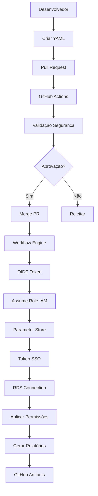

# 🔐 Sistema de Controle de Acesso a Bancos de Dados via GitHub Actions

[](https://github.com/features/actions)
[](https://aws.amazon.com/rds/)
[](https://aws.amazon.com/iam/)
[](https://github.com)

Sistema GitOps para gerenciamento automatizado de permissões de acesso a bancos de dados RDS na AWS via **GitHub Actions**, com autenticação **SSO** e tokens temporários.

## 📋 Índice

- [🎯 Visão Geral](#-visão-geral)
- [✨ Funcionalidades](#-funcionalidades)
- [🏗️ Arquitetura](#️-arquitetura)
- [📋 Pré-requisitos](#-pré-requisitos)
- [⚙️ Configuração AWS](#️-configuração-aws)
- [🔐 Configuração GitHub](#-configuração-github)
- [🚀 Como Usar](#-como-usar)
- [⚙️ Workflows Disponíveis](#️-workflows-disponíveis)
- [🔄 Detecção Automática de Ambiente](#-detecção-automática-de-ambiente)
- [📊 Relatórios de Auditoria](#-relatórios-de-auditoria)
- [🔒 Hierarquia de Permissões](#-hierarquia-de-permissões)
- [🧪 Testes e Validação](#-testes-e-validação)
- [📁 Estrutura do Projeto](#-estrutura-do-projeto)
- [📖 Exemplos de Uso](#-exemplos-de-uso)

## 🎯 Visão Geral

Este sistema implementa um **controle de acesso GitOps** para bancos de dados RDS via **GitHub Actions**, com:

- 🔐 **Autenticação SSO** com tokens temporários
- 🔄 **Automação completa** via workflows GitHub Actions
- 🛡️ **Validação de segurança** obrigatória
- 📊 **Relatórios de auditoria** automáticos
- 🎯 **Permissões granulares** por schema e tabela
- 🌍 **Separação por ambientes** (development/staging/production)
- ✅ **Aprovação via Pull Request** obrigatória

## ✨ Funcionalidades

### 🔐 Controle de Acesso
- ✅ **MySQL**, **PostgreSQL** e **Aurora** via SSO
- ✅ Permissões granulares por **schema** e **tabela**
- ✅ **Tokens temporários** gerados automaticamente
- ✅ **Aprovação obrigatória** via Pull Request
- ✅ **Aplicação automática** após merge

### 📊 Relatórios e Auditoria
- ✅ Relatórios **HTML** e **JSON** automáticos
- ✅ **Download via GitHub Actions** artifacts
- ✅ **Estatísticas detalhadas** de permissões

### 🛡️ Segurança
- ✅ **Autenticação SSO** obrigatória
- ✅ **Tokens temporários** (15 minutos)
- ✅ **Validação de segurança** em todas as operações
- ✅ **Aprovação manual** para produção
- ✅ **Auditoria completa** via Git

## 🏗️ Arquitetura



### 🔄 Fluxo de Trabalho

1. **Criação**: Desenvolvedor solicita criação de usuário no banco de dados com determinadas permissões
2. **Pull Request**: Submete PR para revisão
3. **Validação**: GitHub Actions executa validação automática
4. **Aguardar aprovação** (manual para todos os ambientes: development/staging/production)
5. **Merge**: Aprovação e merge do PR
6. **Aplicação Automática**: `apply_access.yml` executa automaticamente após merge
7. **OIDC**: Token OIDC é gerado pelo GitHub Actions
8. **Assume Role**: Role IAM é assumida via OIDC
9. **Parameter Store**: Credenciais do owner são recuperadas
10. **Aplicação**: Permissões são aplicadas no RDS
11. **Relatório**: Relatório de auditoria é gerado automaticamente

## 📋 Pré-requisitos

### 🔧 Tecnologias
- **GitHub Actions** habilitado no repositório
- **AWS Account** com RDS configurado
- **RDS** com "Password and IAM database authentication" habilitado
- **AWS SSO** configurado para usuários

### 🔑 Permissões AWS
- **RDS**: Acesso via SSO com tokens temporários
- **Parameter Store**: Leitura de credenciais do owner
- **IAM**: Geração de tokens de autenticação
- **OIDC**: Provedor configurado para GitHub Actions

### ⚠️ Importante
- ❌ **NÃO há execução local** - apenas via GitHub Actions
- ✅ **Apenas usuários SSO** podem receber permissões
- ✅ **Aprovação obrigatória** via Pull Request
- ✅ **Autenticação via OIDC** - sem credenciais estáticas

## ⚙️ Configuração AWS

### 1. 🔐 Configurar Provedor OIDC

Adicione o provedor OIDC no IAM:

```bash
# Via AWS CLI
aws iam create-open-id-connect-provider \
  --url https://token.actions.githubusercontent.com \
  --client-id-list sts.amazonaws.com \
  --thumbprint-list 6938fd4d98bab03faadb97b34396831e3780aea1
```

### 2. 🛡️ Criar Role IAM para GitHub Actions

Crie uma role IAM: `GitHubActions_RDSAccessRole`

**Trust Policy:**
```json
{
  "Version": "2012-10-17",
  "Statement": [
    {
      "Effect": "Allow",
      "Principal": {
        "Federated": "arn:aws:iam::<ACCOUNT_ID>:oidc-provider/token.actions.githubusercontent.com"
      },
      "Action": "sts:AssumeRoleWithWebIdentity",
      "Condition": {
        "StringEquals": {
          "token.actions.githubusercontent.com:aud": "sts.amazonaws.com"
        },
        "StringLike": {
          "token.actions.githubusercontent.com:sub": "repo:<owner>/<repo>:<environment>:*"
        }
      }
    }
  ]
}
```

**Permissions Policy:**
```json
{
  "Version": "2012-10-17",
  "Statement": [
    {
      "Effect": "Allow",
      "Action": [
        "ssm:GetParameter",
        "ssm:GetParameters"
      ],
      "Resource": "arn:aws:ssm:*:*:parameter/database-access-control/*"
    },
    {
      "Effect": "Allow",
      "Action": [
        "rds-db:connect"
      ],
      "Resource": "*"
    },
    {
      "Effect": "Allow",
      "Action": [
        "iam:GetUser",
        "iam:ListUsers"
      ],
      "Resource": "*"
    }
  ]
}
```

### 3. 📋 Parameter Store

Crie parâmetros no AWS Systems Manager > Parameter Store > rds-access-control:

```bash
# Padrão: {database}-{engine}-{tipo}
# Para MySQL
ecommerce-mysql-user=admin_user
ecommerce-mysql-password=secure_password

# Para PostgreSQL
analytics-postgres-user=pg_admin
analytics-postgres-password=pg_secure

# Para Aurora
financial-aurora-user=aurora_admin
financial-aurora-password=aurora_secure
```

## 🔐 Configuração GitHub

### 1. 🔑 GitHub Secrets

Configure os seguintes secrets no repositório (adicione dentro de algum Environment):

```bash
# Role IAM para autenticação via OIDC
AWS_ROLE_TO_ASSUME=arn:aws:iam::<account_id>:role/GitHubActions_RDSAccessRole

# Região AWS (opcional - pode ser configurada no Parameter Store)
AWS_REGION=us-east-1
```

> **⚠️ Importante**: Não são necessárias credenciais estáticas (`AWS_ACCESS_KEY_ID` / `AWS_SECRET_ACCESS_KEY`). A autenticação é feita via **OIDC** com a role IAM.

### 2. 🌍 GitHub Environments

Crie os seguintes environments com proteção:

#### Environment: `development`
- ✅ **Aprovação**: Manual
- ✅ **Revisores**: 1 pessoa obrigatória
- ✅ **Timeout**: 15 minutos

#### Environment: `staging`
- ✅ **Aprovação**: Manual
- ✅ **Revisores**: 1 pessoa obrigatória
- ✅ **Timeout**: 30 minutos

#### Environment: `production`
- ✅ **Aprovação**: Manual
- ✅ **Revisores**: 2 pessoas obrigatórias
- ✅ **Timeout**: 60 minutos
- ✅ **Branches**: Apenas `main`

## 🚀 Como Usar

### 1. 📝 Criar Solicitação via Workflow

O sistema oferece workflows interativos para criar solicitações de acesso:

#### 🐬 MySQL Access Control
1. **Acesse**: GitHub Actions > "MySQL Access Control"
2. **Configure**:
   - **Ambiente**: development/staging/production
   - **Email**: usuario@empresa.com
   - **Database**: nome_do_banco
   - **Host**: host.rds.amazonaws.com
   - **Schema**: nome_do_schema
   - **Permissões**: SELECT, INSERT, UPDATE, etc.
3. **Execute**: Run workflow
4. **Resultado**: Pull Request criado automaticamente

#### 🐘 PostgreSQL/Aurora Access Control
1. **Acesse**: GitHub Actions > "PostgreSQL Aurora Access Control"  
2. **Configure**:
   - **Ambiente**: development/staging/production
   - **Engine**: postgres ou aurora
   - **Email**: usuario@empresa.com
   - **Database**: nome_do_banco
   - **Host**: host.rds.amazonaws.com
   - **Schema**: nome_do_schema
   - **Permissões**: SELECT, INSERT, UPDATE, etc.
3. **Execute**: Run workflow
4. **Resultado**: Pull Request criado automaticamente

### 2. 🔄 Aprovação e Merge

1. **Revisar**: Pull Request criado automaticamente
2. **Validar**: Arquivo YAML gerado com permissões corretas
3. **Aprovar**: Reviewer aprova o PR
4. **Merge**: Fazer merge para branch `main`

### 3. 🤖 Aplicação Automática

1. **Detecção**: `apply_access.yml` detecta ambiente automaticamente pelo path
2. **Validação**: Executa validação de segurança obrigatória  
3. **Aprovação**: Aguarda aprovação manual do environment detectado
4. **Aplicação**: Aplica permissões no banco de dados correto
5. **Logs**: Gera logs detalhados da operação no GitHub Actions

### 4. 📊 Gerar Relatórios

```bash
# GitHub Actions > Generate Audit Reports
# Inputs:
# - User Email: usuario@empresa.com
# - Format: html/json
```

> **💡 Importante**: O processo é **totalmente automatizado** após o merge. Não é necessário executar workflows adicionais manualmente!

## 🔄 Detecção Automática de Ambiente

### 🎯 Workflow `apply_access.yml`

O sistema possui um **workflow principal** (`apply_access.yml`) que é executado **automaticamente** após o merge de qualquer Pull Request que modifique arquivos na pasta `users-access-requests/`.

### 🔍 Como Funciona a Detecção

1. **Trigger Automático**: O workflow é disparado automaticamente quando:
   - Há push para a branch `main`
   - Arquivos modificados estão no path `users-access-requests/**.yml`

2. **Extração do Ambiente**: O job `extract-environment` analisa o caminho dos arquivos modificados:
   ```bash
   # Exemplo de detecção:
   users-access-requests/development/mysql/ecommerce/user.yml → development
   users-access-requests/staging/postgres/analytics/user.yml → staging  
   users-access-requests/production/aurora/financial/user.yml → production
   ```

3. **Regex de Detecção**: Utiliza o padrão `users-access-requests/([^/]+)/` para extrair o ambiente
   - **Sucesso**: Usa o ambiente detectado
   - **Fallback**: Se não conseguir detectar, usa `development` como padrão

4. **Aplicação Dinâmica**: O ambiente detectado é passado automaticamente para o job `apply-access`:
   ```yaml
   environment: ${{ needs.extract-environment.outputs.ambiente }}
   ```

### ✅ Vantagens da Detecção Automática

- **🔄 Zero Configuração**: Não precisa especificar ambiente manualmente
- **🎯 Precisão**: Detecta automaticamente baseado no path do arquivo
- **🛡️ Segurança**: Cada ambiente tem suas próprias aprovações e proteções
- **📊 Auditoria**: Todas as operações ficam registradas no GitHub Actions

### 🔧 Fluxo Completo Automatizado

1. **Desenvolvedor**: Cria arquivo YAML no path correto
2. **Pull Request**: Submete para revisão
3. **Aprovação**: Reviewer aprova o PR
4. **Merge**: PR é mergeado na branch `main`
5. **Detecção**: `apply_access.yml` detecta ambiente automaticamente
6. **Validação**: Executa validação de segurança obrigatória
7. **Aprovação**: Aguarda aprovação manual do environment detectado
8. **Aplicação**: Aplica permissões no ambiente correto
9. **Relatório**: Gera logs detalhados da operação

> **💡 Dica**: Não é mais necessário executar workflows específicos por engine. O `apply_access.yml` gerencia tudo automaticamente!

## 📊 Relatórios de Auditoria

### 🎨 Formatos Disponíveis

#### 📄 HTML (Recomendado)
- Interface moderna e responsiva
- Cards estatísticos por ambiente
- Badges coloridos por engine
- Download automático via GitHub Actions

#### 📋 JSON (Automação)
- Estrutura hierárquica completa
- Ideal para integração com ferramentas
- Dados estruturados para análise

### 📈 Como Gerar

1. **Acesse**: GitHub Actions > "Generate Audit Reports"
2. **Configure**:
   - User Email: `usuario@empresa.com`
   - Format: `html` ou `json`
3. **Execute**: Run workflow
4. **Download**: Artifacts gerados automaticamente

### 📋 Tipos de Relatórios

- **👤 Usuário**: Todas as permissões de um usuário específico
- **🗄️ Banco**: Todos os usuários com acesso a um banco

## 🔒 Hierarquia de Permissões

### 🎯 Regra Fundamental
```
Permissões Específicas > Permissões Gerais
Tabela > Schema > Database
```

### 📋 Exemplo Prático

```yaml
schemas:
- nome: financeiro
  permissions: [SELECT, INSERT, UPDATE, DELETE]  # Schema permite tudo
  tables:
  - nome: salarios
    permissions: [SELECT]  # Tabela permite apenas leitura
```

**Resultado**: Usuário **NÃO pode** alterar dados da tabela `salarios`, mesmo tendo permissão no schema.

### 🛡️ Princípio de Segurança

- ✅ **Menor Privilégio**: Sempre aplicar a permissão mais restritiva
- ✅ **Granularidade**: Controle fino por tabela
- ✅ **Herança**: Tabelas herdam permissões do schema quando não especificado
- ✅ **Precedência**: Permissões de tabela sempre prevalecem

## 🧪 Testes e Validação

### 🔍 Validação Automática

Todos os workflows executam validação obrigatória:

```bash
# Executado automaticamente em todos os workflows
python scripts/security_validator.py
```

**Verificações realizadas:**
- ✅ **Credenciais**: Nenhuma credencial exposta nos arquivos
- ✅ **Permissões**: Princípio do menor privilégio aplicado
- ✅ **Estrutura**: Arquivos YAML válidos
- ✅ **Ambientes**: Separação adequada entre ambientes

### 🧪 Como Testar

#### 1. Teste de Validação
```bash
# GitHub Actions > Reusable Security Check
# Executa automaticamente em todos os workflows
```

#### 2. Teste de Conexão
```bash
# GitHub Actions > MySQL/PostgreSQL Access
# Modo: dry-run (apenas testa conexão)
```

#### 3. Teste de Relatórios
```bash
# GitHub Actions > Generate Audit Reports
# Gera relatório de teste para validar funcionamento
```

### ✅ Critérios de Aprovação

Para que um workflow seja executado com sucesso:

1. **✅ Validação de Segurança**: Deve passar sem erros
2. **✅ Aprovação Manual**: Para ambientes stg/prod
3. **✅ OIDC Authentication**: Deve assumir role com sucesso
4. **✅ Conexão RDS**: Deve conectar com sucesso
5. **✅ Aplicação**: Permissões devem ser aplicadas corretamente

## 📁 Estrutura do Projeto

```
database-access-control/
├── 📄 README.md                        # Documentação completa
├── 📄 requirements.txt                 # Dependências Python
├── 📄 .gitignore                       # Arquivos ignorados
├── 📁 .github/workflows/               # GitHub Actions
│   ├── 🔄 mysql_access.yml            # Workflow MySQL
│   ├── 🔄 postgresql_aurora_access.yml # Workflow PostgreSQL/Aurora
│   ├── 🔄 apply_access.yml            # Aplicação geral
│   ├── 🔄 generate-audit-reports.yml  # Geração de relatórios
│   └── 🔄 reusable-security-check.yml # Validação de segurança
├── 📁 scripts/                        # Scripts Python
│   ├── 🐍 apply_permissions.py        # Aplicar permissões
│   ├── 🐍 revoke_permissions.py       # Revogar permissões
│   ├── 🐍 merge_permissions.py        # Merge de permissões
│   ├── 🐍 generate_audit_reports.py   # Gerar relatórios
│   └── 🐍 security_validator.py       # Validação de segurança
└── 📁 users-access-requests/          # Solicitações de acesso
    ├── 📁 development/                # Ambiente desenvolvimento
    ├── 📁 staging/                    # Ambiente staging
    └── 📁 production/                 # Ambiente produção
```

### 📂 Estrutura Hierárquica

```
users-access-requests/
└── {environment}/          # development, staging, production
    └── {engine}/           # mysql, postgres, aurora
        └── {database}/     # nome_do_banco
            └── {user}.yml  # usuario@empresa.com.yml
```

### 📄 Exemplo de Arquivo YAML

```yaml
# users-access-requests/development/mysql/ecommerce/usuario@empresa.com.yml
host: ecommerce-dev.rds.amazonaws.com
user: usuario@empresa.com
database: ecommerce
engine: mysql
region: us-east-1
port: 3306
schemas:
- nome: produtos
  permissions:
    - SELECT
    - INSERT
    - UPDATE
  tables:
  - nome: produtos_precos
    permissions:
      - SELECT  # Apenas leitura para dados sensíveis
- nome: usuarios
  permissions:
    - SELECT
```

> **💡 Nota**: Este arquivo é **gerado automaticamente** pelos workflows de criação. Não é necessário criar manualmente.

### 🔄 Fluxo Completo

1. **Executar workflow** de criação (MySQL/PostgreSQL) via GitHub Actions
2. **Preencher formulário** com permissões necessárias
3. **Pull Request** criado automaticamente com arquivo YAML
4. **Aguardar aprovação** (manual para todos os ambientes: development/staging/production)
5. **Merge** após aprovação
6. **Aplicação automática** via `apply_access.yml` (detecta ambiente pelo path)
7. **OIDC authentication** e assume role automático
8. **Aguardar aplicação** das permissões no banco
9. **Download do relatório** via artifacts (opcional)
10. **Validar acesso** no banco de dados

---

**🔐 Sistema desenvolvido seguindo as melhores práticas de DevSecOps e GitOps**

## ⚙️ Workflows Disponíveis

### 🐬 MySQL Access Control
- **📝 Finalidade**: Criar/alterar permissões de acesso MySQL
- **🔧 Uso**: Workflow interativo via GitHub Actions
- **📋 Inputs Principais**:
  - `ambiente`: development, staging, production
  - `email`: Email do usuário (formato: user@empresa.com)
  - `database`: Nome do banco de dados
  - `host`: Endpoint do RDS MySQL
  - `schema`: Nome do schema
  - `permissões`: SELECT, INSERT, UPDATE, DELETE, etc.
- **📤 Output**: Pull Request com arquivo YAML gerado automaticamente
- **📁 Estrutura**: `users-access-requests/{ambiente}/mysql/{database}/{email}.yml`

### 🐘 PostgreSQL Aurora Access Control  
- **📝 Finalidade**: Criar/alterar permissões PostgreSQL/Aurora
- **🔧 Uso**: Workflow interativo via GitHub Actions
- **📋 Inputs Principais**:
  - `ambiente`: development, staging, production
  - `engine_type`: postgres ou aurora
  - `email`: Email do usuário (formato: user@empresa.com)
  - `database`: Nome do banco de dados
  - `host`: Endpoint do RDS PostgreSQL/Aurora
  - `schema`: Nome do schema
  - `permissões`: SELECT, INSERT, UPDATE, DELETE, TRUNCATE, etc.
- **📤 Output**: Pull Request com arquivo YAML gerado automaticamente
- **📁 Estrutura**: `users-access-requests/{ambiente}/{engine}/{database}/{email}.yml`

### 🤖 Apply DB Access (Automático)
- **📝 Finalidade**: Aplicar permissões automaticamente após merge
- **🔧 Uso**: Executado automaticamente pelo GitHub Actions
- **🎯 Trigger**: Push para branch `main` com arquivos `users-access-requests/**.yml`
- **🔍 Detecção**: Ambiente extraído automaticamente do path do arquivo
- **🛡️ Validação**: Validação de segurança obrigatória antes da aplicação
- **⚙️ Processo**: Conecta no RDS via OIDC e aplica permissões

### 📊 Generate Audit Reports
- **📝 Finalidade**: Gerar relatórios de auditoria por usuário
- **🔧 Uso**: Workflow manual via GitHub Actions
- **📋 Inputs**:
  - `user_email`: Email do usuário para relatório
  - `database_name`: Nome do banco específico (opcional)
  - `output_format`: html ou json
- **📤 Output**: Relatório disponível nos artifacts do workflow
- **📅 Automação**: Relatórios semanais automáticos (agenda configurável)

### 🛡️ Reusable Security Check
- **📝 Finalidade**: Validação de segurança reutilizável
- **🔧 Uso**: Chamado automaticamente por outros workflows
- **🔍 Validações**: 
  - Credenciais não expostas
  - Arquivos YAML válidos
  - Princípio do menor privilégio
  - Estrutura de diretórios correta
- **✅ Resultado**: Aprovação/bloqueio para prosseguir com operações

> **🎯 Fluxo Recomendado**: Use os workflows de criação (MySQL/PostgreSQL) → Approve PR → Automático (Apply DB Access) → Opcional (Generate Reports)